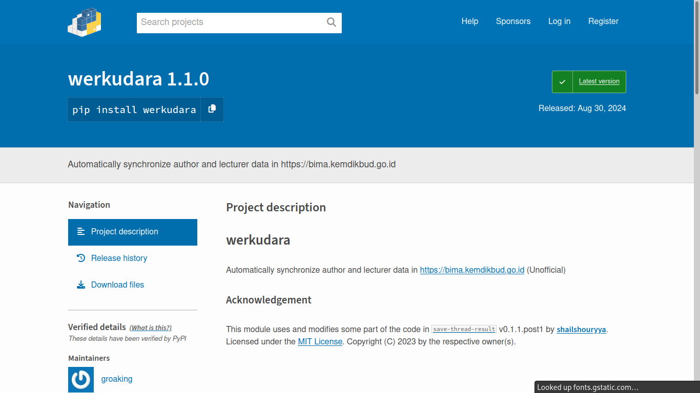

# werkudara
Automatically synchronize author and lecturer data in https://bima.kemdikbud.go.id (Unofficial)

## Documentation (ID)

### Pendahuluan dan Latar Belakang

Saat ini, data kepegawaian, penelitian, dan pengabdian masyarakat dosen perguruan tinggi di Indonesia telah terintegrasi ke dalam satu sistem terpadu, yang disebut BIMA. [BIMA](https://bima.kemdikbud.go.id) merupakan akronim dari _Basis Informasi Penelitian dan Pengabdian kepada Masyarakat_, yang dikembangkan dan diluncurkan oleh Kemdikbudristek pada tahun 2022. Adanya sistem informasi terpadu BIMA membuat pengajuan dan pemutakhiran data penelitian serta pengabdian masyarakat menjadi lebih mudah.

Meskipun demikian, BIMA mempunyai suatu fitur yang belum/tidak diimplementasikan di dalam kerangka sistemnya. Di dalam sistem BIMA, operator BIMA dari masing-masing perguruan tinggi harus menyinkronisasi data kepegawaian dosen yang ada di BIMA dengan data yang terdaftar di Pangkalan Data Pendidikan Tinggi (PD-DIKTI). Tidak ada opsi dalam BIMA untuk melakukan proses sinkronisasi semua data dosen secara jamak. Selama ini, operator BIMA harus membuka halaman profil masing-masing dosen dan mengklik tombol _sinkronisasi_ secara manual, satu per satu. Hal ini tentu memakan proses yang lama, terutama pada universitas-universitas di Indonesia yang memiliki jumlah tenaga pendidik lebih dari lima ratus orang.

**Werkudara** diciptakan untuk menjadi solusi atas permasalahan sinkronisasi data dosen di BIMA. **Werkudara** adalah aplikasi penyinkronisasi jamak data dosen yang ditulis dalam bahasa pemrograman Python dan dibangun di atas kerangka antarmuka PyQt5. Program ini merupakan pengakses tidak resmi (artinya, tidak dibuat oleh pihak yang berafiliasi dengan Kemdikbudristek) dari API BIMA, yang memberikan penggunanya kemampuan untuk melakukan sinkronisasi sebagian atau semua data dosen di BIMA secara serentak, harus membuka profil dosen secara manual, satu per satu.

**Werkudara** merupakan aplikasi sumber terbuka yang memiliki lisensi [GNU General Public License v3.0](https://spdx.org/licenses/GPL-3.0-or-later.html). Artinya, siapa saja boleh mengunduh kode sumber **Werkudara**, memodifikasi sebagian atau seluruh program, serta mendistribusikannya baik untuk tujuan komersial ataupun non-komersial, _selama tidak menggunakan nama program yang sama **dan** dengan memberikan atribusi kepada penulis asli **Werkudara**_.

**Werkudara** dibuat oleh S. Lykamanuella, mahasiswa S1 Fisika Universitas Kristen Satya Wacana (UKSW). Aplikasi ini dipersembahkan untuk Direktorat Riset dan Pengabdian Masyarakat UKSW serta seluruh universitas di Indonesia yang menggunakan sistem informasi BIMA dalam menjalankan operasional pendidikan tinggi.

Dengan adanya program **Werkudara** ini, diharapkan operator BIMA di universitas-universitas di seluruh Indonesia (tidak terbatas pada UKSW saja) dapat dipermudah dalam melakukan proses pemutakhiran data penelitian, pengabdian masyarakat, dan kepegawaian dari dosen dan peneliti pada instansi pendidikan tinggi masing-masing.

### Persiapan

#### Pengunduhan Program

Pastikan Anda telah mengunduh dan memasang Python di komputer Anda. Untuk dapat mengonfigurasi Python, Anda dapat mengunjungi situs [https://www.python.org](https://www.python.org).

Setelah Python terpasang pada sistem operasi yang Anda pakai, bukalah terminal (_Command Prompt_ pada Windows, _CLI_ pada Linux) lalu ketikkan perintah berikut:

```
pip install --upgrade werkudara
```

Perintah tersebut akan mengunduh serta menginstal **Werkudara** dari situs web [PyPI](https://pypi.org/project/werkudara) (Python Package Index). Anda juga dapat mengunduh dan menjalankan **Werkudara** secara manual melalui [repositori sumber terbuka **Werkudara**](https://github.com/groaking/werkudara).



## Acknowledgement

This module uses and modifies some part of the code in [`save-thread-result`](https://github.com/shailshouryya/save-thread-result) v0.1.1.post1 by [**shailshouryya**](https://github.com/shailshouryya). Licensed under the [MIT License](https://spdx.org/licenses/MIT.html). Copyright (C) 2023 by the respective owner(s).
